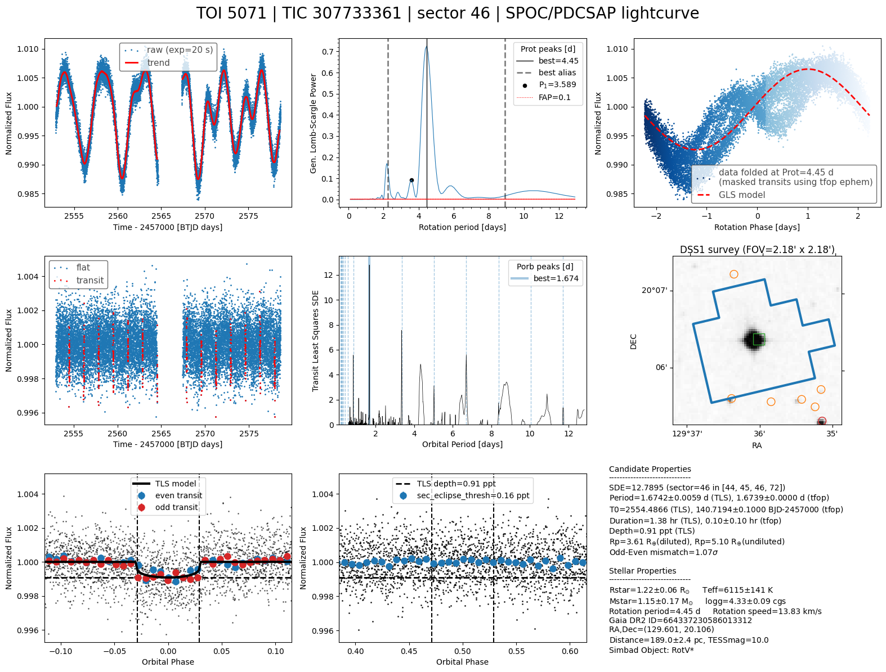

# QuickLook
`quicklook` is a Python program that runs a simple pipeline to search for transit signal in TESS (and Kepler soon) light curves. This program can be run in a jupyter notebook or from the terminal using the `ql` script.

## Use case
Given target name, run periodograms on a TESS or Kepler lightcurve (if it exists) to measure the stellar rotation period and the orbital period of a potential companion i.e. planet, brown dwarf, or star.
Although `quicklook` is optimized to find transiting exoplanets, this tool can also find eclipsing binaries and many other periodic signals.

## Installation
Create a conda environment called, say `my_env`, and install there the latest version of `quicklook-package`
```bash
$ conda create -n my_env python=3.10
$ conda activate my_env
(my_env) $ pip install -U quicklook-package
```

If you want to run `quicklook` locally in a notebook, you also need to install jupyter
```
(my_env) $ pip install jupyter notebook
```
See [example notebook](https://github.com/jpdeleon/quicklook/blob/main/notebook/examples.ipynb).

## Try it on Google colab

<a href="https://colab.research.google.com/github/jpdeleon/quicklook/blob/main/notebook/examples.ipynb" target="_parent"></a>

## Command line script
```bash
(my_env) $ ql
usage: ql [-h] [--name NAME] [--sector SECTOR] [--fluxtype {pdcsap,sap}] [--pipeline {spoc,tess-spoc,tasoc,cdips,pathos,qlp,tglc}] [--exptime EXPTIME] [--flatten_method FLATTEN_METHOD] [--pg_method {gls,ls,bls}]
          [--window_length WINDOW_LENGTH] [--edge_cutoff EDGE_CUTOFF] [--sigma_clip_raw SIGMA_CLIP_RAW SIGMA_CLIP_RAW] [--sigma_clip_flat SIGMA_CLIP_FLAT SIGMA_CLIP_FLAT]
          [--period_limits PERIOD_LIMITS PERIOD_LIMITS] [--survey {dss1,poss2ukstu_red,poss2ukstu_ir,poss2ukstu_blue,poss1_blue,poss1_red,all,quickv,phase2_gsc2,phase2_gsc1}]
          [--custom_ephem CUSTOM_EPHEM CUSTOM_EPHEM CUSTOM_EPHEM CUSTOM_EPHEM CUSTOM_EPHEM CUSTOM_EPHEM] [--outdir OUTDIR] [-save] [-verbose] [-overwrite] [-mask_ephem]

Run a quick look analysis of a TESS lightcurve.
Notes:
* use single hyphen (-flag) if no value is needed.
* use double hyphen (--flag value) if value is needed.

Example: ql --name TOI-5071 --sector 46 -save -verbose

options:
  -h, --help            show this help message and exit
  --name NAME           target name
  --sector SECTOR       TESS sector (default=-1 (last available sector))
  --fluxtype {pdcsap,sap}
                        type of lightcurve
  --pipeline {spoc,tess-spoc,tasoc,cdips,pathos,qlp,tglc}
                        lightcurve produced from which pipeline (default=SPOC)
  --exptime EXPTIME     exposure time (default is whatever is used in available sector)
  --flatten_method FLATTEN_METHOD
                        wotan flatten method (default=biweight)
  --pg_method {gls,ls,bls}
                        periodogran method (default=gls)
  --window_length WINDOW_LENGTH
                        flatten method window length (default=0.5 days)
  --edge_cutoff EDGE_CUTOFF
                        cut each edges (default=0.1 days)
  --sigma_clip_raw SIGMA_CLIP_RAW SIGMA_CLIP_RAW
                        (sigma_lo,sigma_hi) for outlier rejection of raw lc before flattening/detrending
  --sigma_clip_flat SIGMA_CLIP_FLAT SIGMA_CLIP_FLAT
                        (sigma_lo,sigma_hi) for outlier rejection of flattened/detrended lc
  --period_limits PERIOD_LIMITS PERIOD_LIMITS
                        period limits in TLS search; default=(0.5, baseline/2) d
  --survey {dss1,poss2ukstu_red,poss2ukstu_ir,poss2ukstu_blue,poss1_blue,poss1_red,all,quickv,phase2_gsc2,phase2_gsc1}
                        archival image survey name if using img option (default=dss1)
  --custom_ephem CUSTOM_EPHEM CUSTOM_EPHEM CUSTOM_EPHEM CUSTOM_EPHEM CUSTOM_EPHEM CUSTOM_EPHEM
                        custom ephemeris in days. Example: --custom_ephem Tc Tcerr P Perr Tdur Tdurerr
  --outdir OUTDIR       output directory
  -save                 save figure and tls
  -verbose              show details
  -overwrite            overwrite files
  -mask_ephem           mask transits either using TFOP or custom ephemerides if available (default=False)
```

## Examples

1. Run `quicklook` on the most recent TESS lightcurve of TOI-5071 (aka K2-100).

```shell
(my_env) $ ql --name TOI-5071
```


The figure above shows 9 panels. Let's break them down.
* top row
  - left (panel 1): raw lightcurve (blue marker) and trend (red line)
  - middle (panel 2): [Lomb-Scargle periodogram](https://docs.astropy.org/en/stable/timeseries/lombscargle.html) used to estimate the star's rotation period; this is useful to find active and variable stars
  - right (panel 3): raw lightcurve phase-folded at the computed peak of Lomb-Scargle periodogram (corresponding to the stellar rotation period) from panel 1;
* middle row
  - left (panel 4): raw lightcurve divided by the trend line (aka flattened lightcurve) in panel 1 and the detected transits (red markers; determined from the TLS periodogram in panel 5)
  - middle (panel 5): periodogram using the [transit least squares](https://ui.adsabs.harvard.edu/abs/2019A%26A...623A..39H/abstract) (TLS) algorithm
  - right (panel 6): TESS aperture (blue polygon) centered on the target and the positions of nearby sources from the Gaia survey (orange and red markers) overlaid on the archival [DSS](https://archive.stsci.edu/cgi-bin/dss_form) image; this is useful to see if there are other stars that can be the source of the signal aside from the target
* bottom row
  - left (panel 7): phase-folded lightcurve at the derived peak of TLS periodogram (corresponding to the orbital period); odd (red markers) and even (blue markers) transits and best-fit transit model (black line) are also shown
  - middle (panel 8): phase-folded lightcurve zoomed at phase=0.5 to check for a secondary eclipse which is a strong indicator of a self-luminous companion such as an eclipsing binary or a high-albedo brown dwarf; the computed transit depth (horizontal dashed line) and transit duration (vertical dashed line) are shown for reference
  - right (panel 9): summary info about the star and potential companion (e.g. planet candidate)

Try changing the parameters:
```shell
(my_env) $ ql --name TIC-52368076 -verbose -save | tee output.log
(my_env) $ ql --name TOI-125.01 --pipeline qlp #specific pipeline
(my_env) $ ql --name TOI-125.01 --sector 2 #specific TESS sector
(my_env) $ ql --name TOI-125.01 --flatten_method cosine #specific function to detrend baseline
(my_env) $ ql --name TOI-125.01 --period_limits 1 5 #limit search between 1-5 days
```

## Advanced usage

If you would like to run `ql` on a list of TIC IDs (saved as `tic_ids.txt`), then you can make a batch script named `run_ql_given_tic.batch`. The output files containing the logs (*.log), plots (*.png), and periodogram results (*_tls.h5) will be saved in `tic_dir` directory:

```shell
(my_env) $ cat tic_ids.txt | while read tic; do echo ql --name TIC$tic -save --outdir tic_dir | tee TIC$tic.log; done > run_ql_given_tic.batch
```

To test the Nth line of the batch script,

```shell
(my_env) $ cat run_ql_given_tic.batch | sed -n Np | sh
```

To run all the lines in parallel using [GNU parallel](https://www.gnu.org/software/parallel/) with N cores,

```shell
(my_env) $ cat run_ql_given_tic.batch | parallel -j N
```

After the batch script is done running, we can rank `ql` output in terms of Signal Detection Efficiency (SDE, See [Hippke et al. 2019](https://ui.adsabs.harvard.edu/abs/2019A%26A...623A..39H/abstract)) using `read_tls` script:

```shell
(my_env) $ read_tls tic_dir
```
