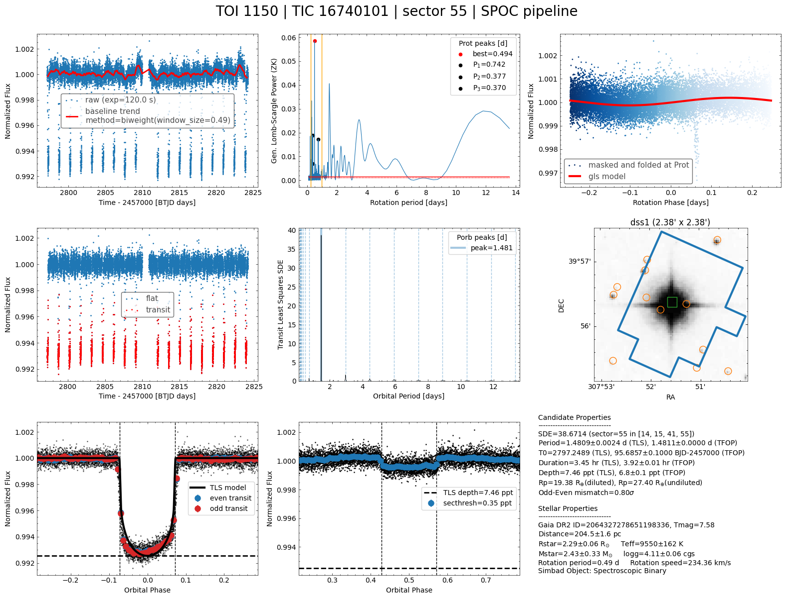

# QuickLook
`quicklook` is a Python program that runs a simple pipeline to search for a transit signal in TESS and Kepler light curves. This program can be run in a jupyter notebook (see below) or from the terminal using the `ql` script.

## Use case
Given target name, run periodogram on a TESS of Kepler lightcurve (if it exists) to estimate the stellar rotation period and the orbital period of a potential companion i.e. planet brown, dwarf, or star.
Although `quicklook` is optimized to find transiting exoplanets, this tool can also find eclipsing binaries and many other periodic signals.

## Try it on Google colab

<a href="https://colab.research.google.com/github/jpdeleon/quicklook/blob/main/notebook/examples.ipynb" target="_parent"></a>




## Installation
* Create a conda environment called, say my_env, and install there an editable version of `quicklook`
```bash

$ conda create -n my_env python=3.10
$ conda activate my_env
(my_env) python -m python -m pip install -r https://raw.githubusercontent.com/jpdeleon/quicklook/main/requirements.txt
(my_env) python -m pip install -e git+https://github.com/jpdeleon/quicklook.git#egg=quicklook
(my_env) $ python -m pip install jupyterlab
```

## Script
```bash
(my_env) $ ql
usage: ql [-h] [-name NAME] [-sec SECTOR] [-lc {pdcsap,sap}]
          [-p {spoc,tess-spoc,cdips,pathos,qlp,tglc}] [-e EXPTIME]
          [-fm FLATTEN_METHOD] [-pm {gls,ls,bls}] [-wl WINDOW_LENGTH]
          [-ec EDGE_CUTOFF] [--sigma_clip_raw SIGMA_CLIP_RAW SIGMA_CLIP_RAW]
          [--sigma_clip_flat SIGMA_CLIP_FLAT SIGMA_CLIP_FLAT]
          [-plims PERIOD_LIMITS PERIOD_LIMITS] [-s] [-o OUTDIR] [-v]
          [--overwrite] [-img]
          [--survey {dss1,poss2ukstu_red,poss2ukstu_ir,poss2ukstu_blue,poss1_blue,poss1_red,all,quickv,phase2_gsc2,phase2_gsc1}]
          [-em EPHEM_MASK EPHEM_MASK EPHEM_MASK]

create quick look image of TESS data

options:
  -h, --help            show this help message and exit
  -name NAME            target name
  -sec SECTOR, --sector SECTOR
                        TESS sector
  -lc {pdcsap,sap}, --fluxtype {pdcsap,sap}
                        type of lightcurve
  -p {spoc,tess-spoc,cdips,pathos,qlp,tglc}, --pipeline {spoc,tess-spoc,cdips,pathos,qlp,tglc}
                        lightcurve produced from which pipeline
  -e EXPTIME, --exptime EXPTIME
                        exposure time (default is whatever is found in last
                        sector)
  -fm FLATTEN_METHOD, --flatten_method FLATTEN_METHOD
                        wotan flatten method (default=biweight)
  -pm {gls,ls,bls}, --pg_method {gls,ls,bls}
                        periodogran method (default=gls)
  -wl WINDOW_LENGTH, --window_length WINDOW_LENGTH
                        flatten method window length (default=0.5 days)
  -ec EDGE_CUTOFF, --edge_cutoff EDGE_CUTOFF
                        cut each edges (default=0.1 days)
  --sigma_clip_raw SIGMA_CLIP_RAW SIGMA_CLIP_RAW
                        (sigma_lo,sigma_hi) for outlier rejection after
                        flattening lc
  --sigma_clip_flat SIGMA_CLIP_FLAT SIGMA_CLIP_FLAT
                        (sigma_lo,sigma_hi) for outlier rejection after
                        flattening lc
  -plims PERIOD_LIMITS PERIOD_LIMITS, --period_limits PERIOD_LIMITS PERIOD_LIMITS
                        period limits in TLS search; default=(0.5, baseline/2)
                        d
  -s, --save            save figure and tls
  -o OUTDIR, --outdir OUTDIR
                        output directory
  -v, --verbose         show details
  --overwrite           overwrite files
  -img, --use_archival_image
                        plot gaia sources on archival image instead of tpf
  --survey {dss1,poss2ukstu_red,poss2ukstu_ir,poss2ukstu_blue,poss1_blue,poss1_red,all,quickv,phase2_gsc2,phase2_gsc1}
                        archival image survey name if using img option
  -em EPHEM_MASK EPHEM_MASK EPHEM_MASK, --ephem_mask EPHEM_MASK EPHEM_MASK EPHEM_MASK
                        mask ephemeris given period and t0
```

## Examples

1. Show quick look plot of TOI 241.01 with archival image

```shell
(ql) $ ql -name TOI-241 -img
```

The figure above shows 9 panels. Let's break them down.
* top row
  - left (panel 1): raw lightcurve (blue marker) and trend (red line)
  - middle (panel 2): [Lomb-Scargle periodogram](https://docs.astropy.org/en/stable/timeseries/lombscargle.html) used to estimate the star's rotation period; this is useful to find active and variable stars
  - right (panel 3): raw lightcurve phase-folded at the computed peak of Lomb-Scargle periodogram (corresponding to the stellar rotation period) from panel 1;
* middle row
  - left (panel 4): flattened lightcurve and detected transits (determined from the TLS periodogram on panel 5)
  - middle (panel 5): periodogram using the [TLS](https://arxiv.org/abs/1901.02015) algorithm
  - right (panel 6): TESS aperture (blue polygon) and annotated Gaia sources (orange and red markers) overlaid on archival [DSS](https://archive.stsci.edu/cgi-bin/dss_form) image centered on the target; this is useful to see if there are potential sources of the signal other than the target
* bottom row
  - left (panel 7): phase-folded lightcurve at the derived peak of TLS periodogram (corresponding to the orbital period); odd (red markers) and even transits (blue markers) and best-fit transit model (black line) are also shown
  - middle (panel 8): phase-folded lightcurve zoomed at phase=0.5 to check for a secondary eclipse which is a strong indicator of a self-luminous companion such as an eclipsing binary or a high-albedo brown dwarf; the computed transit depth (dashed line) is shown for reference
  - right (panel 9): summary info about the star and (planet) candidate

Try changing the parameters:
```shell
(my_env) $ ql -name TIC52368076 -v -s (uses pdcsap by default)
(my_env) $ ql -name TOI-125.01 -v  -s -p qlp #specific pipeline
(my_env) $ ql -name TOI-125.01 -v -s -sec 2 #specific TESS sector
```

## Advanced usage

If you would like to run `ql` on a list of TIC IDs (saved as new_tics.txt), then we have to make a batch script named run_ql_new_tics.batch. Its output files containing the plots (*.png) and tls_results (*.h5) will be saved in new_tics directory:

```shell
$ cat new_tics.txt | while read tic; do echo ql -tic $tic -pld -s -o ../new_tics; done > run_ql_new_tics.batch
```

To test the Nth line of the batch script,

```shell
$ cat run_ql_new_tics.batch | sed -n Np | sh
```

To run all the lines in parallel using N cores,

```shell
$ cat run_ql_new_tics.batch | parallel -j N
```

After the batch script is done, we can rank TLS output in terms of SDE using rank_tls script:

```shell
(my_env) $ read_tls indir
