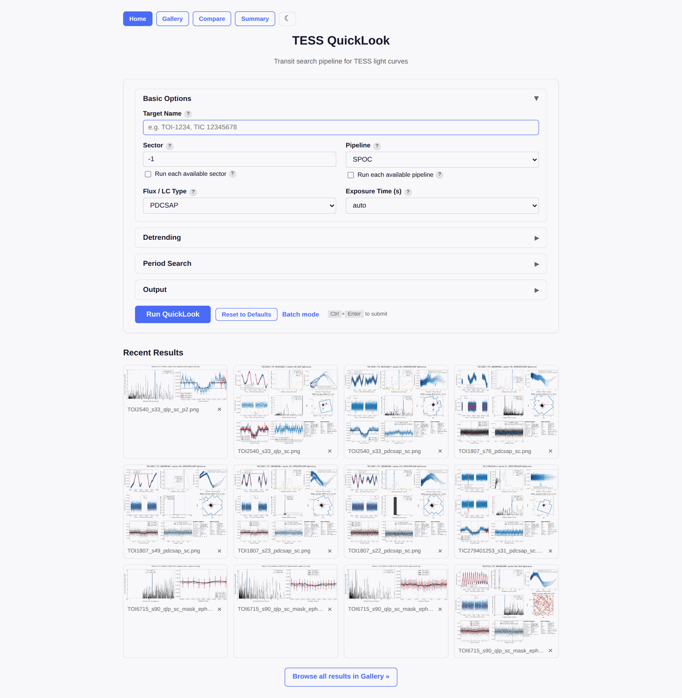
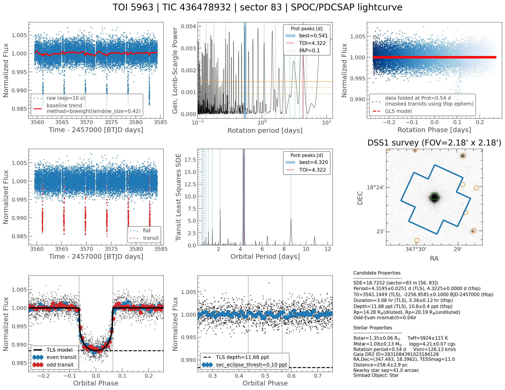

# QuickLook

[](https://quicklook.readthedocs.io/en/latest/)
[](https://github.com/jpdeleon/quicklook/actions/workflows/build-and-test.yml)
[](https://pypi.org/project/quicklook-package/)
[](https://pypi.org/project/quicklook-package/)
[](https://deepwiki.com/jpdeleon/quicklook)

`quicklook` is a Python pipeline that searches for transit signals in [TESS](https://tess.mit.edu/) light curves. Given a target name, it downloads the light curve, estimates the stellar rotation period, searches for transiting companions using the [Transit Least Squares](https://ui.adsabs.harvard.edu/abs/2019A%26A...623A..39H/abstract) (TLS) algorithm, and produces a publication-ready 9-panel diagnostic figure.

Although `quicklook` is optimized to find transiting exoplanets, it can also detect eclipsing binaries, variable stars, and other periodic signals.

## Features

- **Multi-pipeline support** -- SPOC, TESS-SPOC, QLP, CDIPS, PATHOS, TGLC, TASOC, T16
- **Flux / light-curve type** -- PDCSAP or SAP for SPOC; aperture or PSF photometry for TGLC, with an automatic best-quality default
- **Automated detrending** -- biweight, cosine, median, GP, and other [wotan](https://github.com/hippke/wotan) methods
- **Stellar rotation** -- Generalized Lomb-Scargle (GLS) periodogram
- **Transit detection** -- Transit Least Squares (TLS) periodogram
- **Neighbor check** -- Gaia source overlay on cached archival sky images, with optional nearby SIMBAD object labels
- **Batch processing** -- `--each-sector` mode, GNU parallel support, and candidate ranking tools
- **Web GUI** -- Flask-based interface with live progress, job queue, and gallery
- **HDF5 output** -- full TLS results saved for downstream filtering

## Installation

Requires Python 3.10+. Install with `uv` (recommended) or `pip`:

```bash
# uv (recommended)
uv tool install quicklook-package

# or pip
pip install -U quicklook-package
```

### Optional extras

```bash
# Web GUI
pip install -U "quicklook-package[gui]"

# Jupyter notebooks
pip install -U "quicklook-package[notebooks]"

# Development (testing, linting, formatting)
pip install -U "quicklook-package[dev]"
```

## Try it on Google Colab

<a href="https://colab.research.google.com/github/jpdeleon/quicklook/blob/main/notebook/examples.ipynb" target="_parent"></a>

## Usage

### Command line

The `ql` CLI provides subcommands for analysis and post-processing:

```bash
ql --help          # show commands: run, read-tls, rank-tls
ql run --help      # full analysis options
ql read-tls --help  # extract TLS results to CSV
ql rank-tls --help  # filter and rank candidates
```

```bash
# Basic run on the latest TESS sector
ql run --name WASP-21 --save --verbose

# Specific sector and pipeline
ql run --name TOI-125.01 --sector 2 --pipeline qlp

# Custom detrending
ql run --name TOI-125.01 --flatten-method cosine --window-length 0.3

# Restrict TLS period search range
ql run --name TOI-125.01 --period-limits 1 5

# Run on every available sector
ql run --name TOI-125.01 --each-sector --save

# Run all sectors with 4 parallel workers
ql run --name TOI-125.01 --each-sector -j 4 --save

# Run every available pipeline on the latest sector
ql run --name TOI-125.01 --each-pipeline --save

# TGLC PSF photometry with nearby SIMBAD objects overlaid
ql run --name TOI-125.01 --pipeline tglc --fluxtype psf --show-simbad --save
```

> **Note:** Old-style `-save` / `-verbose` flags and the standalone
> `read_tls` / `rank_tls` commands still work via automatic redirect.
> Underscore flags (`--flatten_method`) are interchangeable with hyphens
> (`--flatten-method`).

### Python API

```python
from quicklook import TessQuickLook

ql = TessQuickLook(
    target_name="WASP-21",
    sector=56,
    pipeline="SPOC",
    flux_type="pdcsap",
    verbose=True,
)

fig = ql.plot_tql()

# Access results
print(f"Rotation period: {ql.Prot_ls:.2f} days")
print(f"TLS period: {ql.tls_results.period:.4f} days")
print(f"TLS SDE: {ql.tls_results.SDE:.1f}")
```

For **SPOC**, `flux_type` selects `"pdcsap"` or `"sap"`. For **TGLC**, the same
argument selects the photometry method -- `"aperture"` or `"psf"`; any other
value (including the default) uses automatic selection of the less-contaminated,
lower-scatter light curve. TGLC light curves absent from MAST are extracted
locally via effective-PSF (ePSF) photometry.

### Web GUI

```bash
ql-gui
```

Open http://127.0.0.1:5000 in your browser. Enter a target, adjust parameters, and click **Run QuickLook**. Progress is streamed live via WebSocket. Supports single targets, batch submission, and each-sector mode.



The Flask debugger is off by default. Set `QUICKLOOK_DEBUG=1` to enable it and
the auto-reloader while developing:

```bash
QUICKLOOK_DEBUG=1 ql-gui
```

Leave it unset on any host other users can reach — the Werkzeug debugger
exposes an interactive console to whoever can open the port.

## Output figure

```bash
ql run --name WASP-21 --save --verbose
```



The 9-panel figure shows:

| Panel | Content |
|-------|---------|
| 1 | Raw light curve + trend line |
| 2 | GLS periodogram (stellar rotation period) |
| 3 | Phase-folded light curve at rotation period |
| 4 | Flattened light curve + detected transits |
| 5 | TLS periodogram (orbital period) |
| 6 | TESS aperture + Gaia sources (and optional SIMBAD objects) on archival image |
| 7 | Phase-folded transit (odd/even comparison) |
| 8 | Secondary eclipse check at phase 0.5 |
| 9 | Summary of stellar and companion parameters |

## CLI tools

| Command | Description |
|---------|-------------|
| `ql run` | Run the full QuickLook pipeline on a target |
| `ql read-tls` | Extract TLS results from a directory of `.h5` files into a CSV |
| `ql rank-tls` | Filter and rank candidates by SDE from the CSV output |
| `ql-gui` | Launch the web GUI (requires `[gui]` extra) |

## Batch processing

Process a list of TIC IDs:

```bash
# Generate batch script
cat tic_ids.txt | while read tic; do
  echo "ql run --name TIC$tic --save --outdir results | tee TIC$tic.log"
done > run_batch.sh

# Run in parallel with GNU parallel
cat run_batch.sh | parallel -j 4

# Extract and rank results
ql read-tls results/
ql rank-tls results/ --output-dir ranked

# Combine ranked plots into a PDF
pip install img2pdf
img2pdf ranked/*.png --output ranked.pdf
```

## Documentation

Full documentation is available at [quicklook.readthedocs.io](https://quicklook.readthedocs.io/en/latest/).

## License

See [LICENSE](LICENSE) for details.
