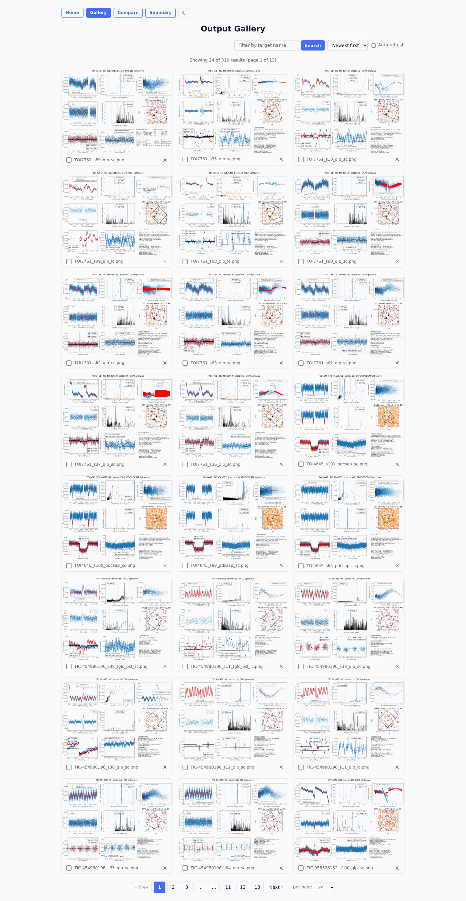

# Web GUI

QuickLook includes a Flask-based web interface for interactive analysis with live progress streaming.


## Starting the GUI

```bash
pip install -U "quicklook-package[gui]"
ql-gui
```

This starts a local server at [http://127.0.0.1:5000](http://127.0.0.1:5000).

!!! note
    The GUI runs pipeline jobs serially (one at a time) because lightkurve, astropy, and matplotlib share global state that is not thread-safe. Jobs submitted while another is running are queued and executed in order.

## Features

### Single target analysis

1. Enter a target name (TOI, TIC, or common name)
2. Adjust pipeline parameters (sector, pipeline, flux type, etc.)
3. Optionally toggle **Show SIMBAD** to overlay nearby non-stellar SIMBAD objects on the archival image (on by default in the GUI)
4. Click **Run QuickLook**
5. Watch live progress with step-by-step updates and ETA

### Each-sector mode

Check **Run each available sector** to automatically query all available sectors for the target and submit one job per sector. Jobs are queued and processed sequentially.

### Batch submission

Submit multiple targets at once. Each target runs with the same pipeline parameters. The job queue panel shows the status of all jobs.

### Job queue

The right-side panel shows all submitted jobs with their status:

- **Queued** -- waiting for the worker to pick it up
- **Running** -- currently executing
- **Done** -- completed successfully
- **Error** -- failed (hover for error details)
- **Cancelled** -- cancelled by user

Click a queued or running job to watch its live log output. Jobs auto-advance -- when one finishes, the WebSocket automatically connects to the next queued job.

### Results

Completed jobs display the output figure inline. Click to view full size. Results are saved in `quicklook/app/static/outputs/`.

### Gallery

The `/gallery` page shows all previously generated output figures with search, sorting, and pagination. Click a thumbnail to open it in a zoomable modal -- pan by dragging, and use the **left/right arrow keys** to step between figures without closing the viewer.



### Cancelling jobs

Click the **Cancel** button on a running or queued job to stop it. Queued jobs are skipped immediately when the worker reaches them.

### Deleting outputs

Right-click a result or use the delete button to remove output files (PNG and H5).

## Configuration

The GUI stores form state in the browser's localStorage, so your settings persist across page reloads. Click **Reset** to restore defaults.

## Dark mode

Click the theme toggle in the header to switch between light and dark mode. The preference is saved in localStorage.
